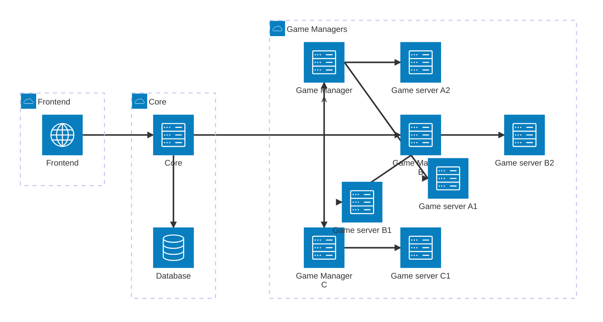

# What is this folder for?

It contains my first thoughts about the project. Especially, how I want to
structure and design it.

## How do I want to structure the project?

Globally, i want to arrange the project in the cleaner way possible, so it will
be easier to maintain and extend. To achieve this, I was thinking about a
micro-services architecture. This way, anyone would be able to integrate new
games or services to the core project without having to touch the core code.

We can divide the project in 3 main parts:

1. **Frontend**: The client side of the project. This is the dashboard from
   where the users will be able to manage their game servers. The idea will be
   to take advantage of [Modules Federations](https://module-federation.io/) to
   create a micro-frontend architecture.

2. **Core**: The core of the project. All the main logic will be located here.
   It will be responsible for managing the game servers, the users with
   authentication (passwod, OAuth2, etc).

3. **Game manager**: A game manager will be the dedicated implementation to
   manage gate servers. Let's say we want to add a new game server, we will have
   to create a new game manager for it. This game manager will be registered to
   the core and will also provide frontend files to extend the interface.

> ![INFO] At the moment, I am only thinking about deploying to Kubernetes. But
> depending on how things evolves, I might also consider other backends like
> Docker/Podman.

From the explanation above, this should give something like this:

## How game servers will be deployed?

To deploy game servers, game managers take take advantage of Kubernetes custom
resources. This are, in fact, kubernetes operators that will extends the
Kubernetes API with custom resources.

For example, let's say we want to deploy a Minecraft server. We will have to
create a new custom resource for it. This custom resource will be managed by the
Minecraft game manager. This game manager will be responsible for creating the
game server, managing it and also providing the frontend files to extend the
interface. This also include all the possible logic and actions related to a
servers like managings backups, worlds, mods, etc.

## How game managers will be deployed?

To deplay game managers, i was thinking about 3 ways:

1. Deploying them using custom resources to declare them. Which means it would
   be possible to deploy a game manager by both creating a custom resource or
   from the frontend.
2. Deploying them as a sidecar container to the core. So they would be embedded
   aside the core inside the Helm chart.
3. Deploying them completely separated from the core. So, they would require
   their own Helm chart.

For now, I am considering the first option. But a study should be done to ensure
this is the best way to go.

Another possibility is that the core support custom resources, and the user can
either deploy the game manager CR from the UI, deploy it manually, or deploy it
through a Helm chart.

## How would the project be extensible?

Like explained in the previous section, the project will be extensible by
creating new game managers interacting with Kubernetes. Each game manager will
be responsible for managing a specific game server.
